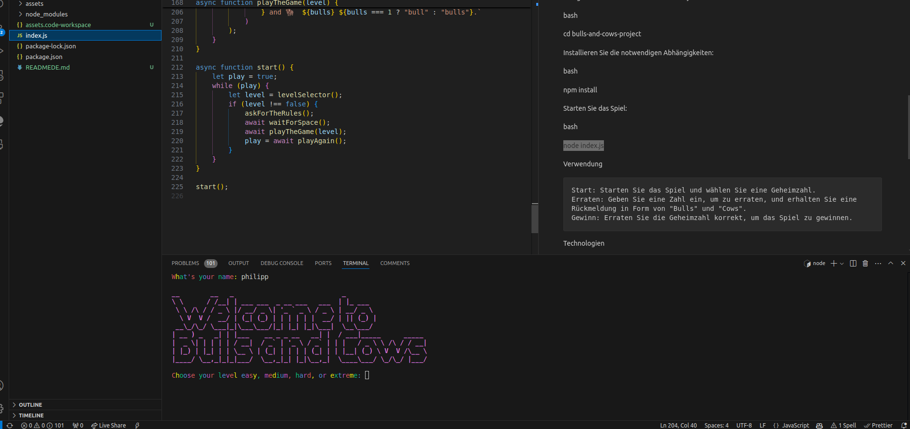

Autor: Philipp Sauerländer

E-mail: Tiamat15@hotmail.de

GitHub: https://github.com/monty150172/bulls-and-cows-project

Bulls and Cows Project

Dieses Repository enthält eine Implementierung des klassischen Spiels "Bulls and Cows". Es handelt sich um ein Ratespiel, bei dem ein Spieler die versteckte Zahl erraten muss, indem er Hinweise in Form von "Bulls" und "Cows" erhält.
Inhalt

    Spielregeln
    Installation
    Verwendung
    Technologien
    Lizenz

Spielregeln

"Bulls and Cows" ist ein Denkspiel für zwei Spieler, bei dem einer eine geheime Zahl auswählt und der andere versucht, sie zu erraten. Die Regeln sind wie folgt:

    Der Code besteht aus einer Reihe von Ziffern, die vom erratenden Spieler zu erraten sind.
    Nach jedem Rateversuch gibt der Codemaster eine Rückmeldung:
        Bull: Eine Ziffer ist korrekt und befindet sich an der richtigen Position.
        Cow: Eine Ziffer ist korrekt, befindet sich jedoch an der falschen Position.
    Ziel des Spiels ist es, die geheime Zahl mit möglichst wenigen Versuchen vollständig zu erraten.

Installation

Um das Spiel lokal auszuführen, folgen Sie diesen Schritten:

    Klonen Sie das Repository:

    bash

git clone https://github.com/monty150172/bulls-and-cows-project.git

Navigieren Sie in das Verzeichnis des Projekts:

bash

cd bulls-and-cows-project

Installieren Sie die notwendigen Abhängigkeiten:

bash

npm install

Starten Sie das Spiel:

bash

node index.js

Verwendung

    Start: Starten Sie das Spiel und wählen Sie eine Geheimzahl.
    Erraten: Geben Sie eine Zahl ein, um zu erraten, und erhalten Sie eine Rückmeldung in Form von "Bulls" und "Cows".
    Gewinn: Erraten Sie die Geheimzahl korrekt, um das Spiel zu gewinnen.

Technologien

Dieses Projekt verwendet die folgenden Technologien:

    JavaScript: Programmiersprache für die Spielmechanik
    HTML/CSS: Für die Benutzeroberfläche und das Styling des Spiels
    Node.js und npm: Zum Verwalten der Abhängigkeiten und des Entwicklungsprozesses

Lizenz

Dieses Projekt ist unter der MIT-Lizenz lizenziert – siehe die LICENSE-Datei für Details.
